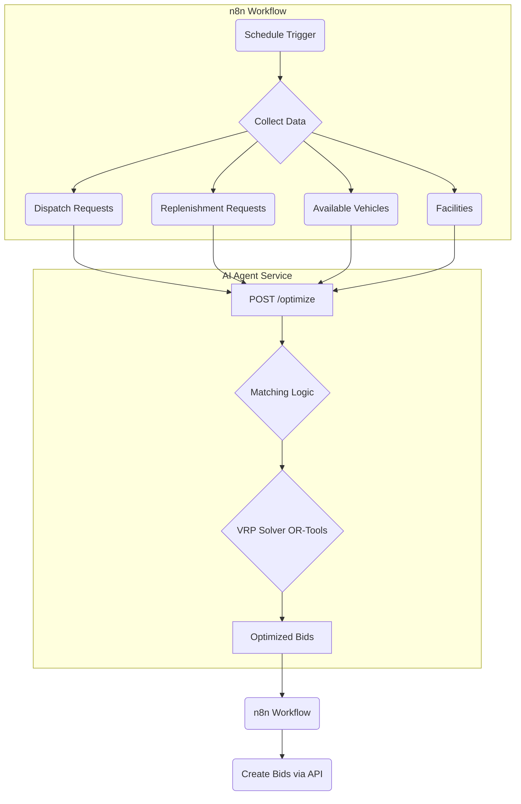

# Fresh Meat SCM - AI Agent

This repository contains the AI Agent for the Fresh Meat Supply Chain (`fresh-meat-scm`) project. This service acts as the intelligent core of the logistics network, responsible for automating the complex task of creating optimized transport plans.

It is designed as a Python microservice with a REST API, intended to be triggered by a workflow orchestrator like n8n.

---

## Core Functionality

The primary goal of this agent is to replace the manual process of a human administrator. It receives the current state of the supply chain and outputs a series of optimized transport bids.

The process is divided into two main phases:

### 1. Business Logic Matching ("Where should goods go?")

The agent first applies a set of business rules to determine the optimal destination for each pending dispatch request:
- **Raw Materials (from Farms):** Are routed to the nearest available `Processor`.
- **Finished Goods (from Processors):** Are prioritized to fulfill pending `Replenishment Requests` from `Retailers`.
- **Surplus Goods:** Any remaining finished goods are routed to the nearest available `Warehouse`.

### 2. VRP Optimization ("How should goods get there?")
After determining the required pickup and delivery tasks, the agent uses **Google OR-Tools** to solve the Vehicle Routing Problem (VRP).
- **Objective:** Minimize the total travel distance of the entire fleet.
- **Constraints:**
    - Vehicle capacity (payload).
    - Vehicle type (e.g., refrigerated vs. non-refrigerated).
    - Pickup must occur before the corresponding delivery.

The final output is a list of optimized `TransportBid` objects, each containing a multi-stop route for a specific vehicle and driver.

---

## Architecture & How it Works

This service is designed to be called by a workflow automation tool (like n8n), not directly by end-users.



---

## Technology Stack

- **Language:** Python 3.9+
- **API Framework:** Flask
- **Optimization Solver:** Google OR-Tools
- **Containerization:** Docker & Docker Compose

---

## Getting Started

### Prerequisites
- Docker
- Docker Compose

### Configuration
1. Create a `.env` file in the root directory by copying `.env.example`.
2. Fill in the required environment variables:
    - `API_SERVER_URL`: The URL of the main `fresh-meat-scm-api-server`.
    - `AGENT_API_TOKEN`: A valid JWT token for a user with `admin` privileges, used by the agent to fetch data.

### Running the Service
To build and run the AI Agent service along with its n8n orchestrator, use the following command:

```bash
docker-compose up --build -d
```
- The AI Agent will be available at `http://localhost:5001`.
- The n8n interface will be available at `http://localhost:5678`.

---

## API Endpoint

### `POST /optimize`

This is the main endpoint that triggers the optimization process.

- **Request Body:** A JSON object containing the current state of the network.
  ```json
  {
    "dispatchRequests": [...],
    "replenishmentRequests": [...],
    "availableVehicles": [...],
    "allFacilities": [...],
    "productCatalog": [...]
  }
  ```

- **Success Response (200 OK):** A JSON array of optimized `TransportBid` objects, ready to be sent to the `POST /api/v1/transport-bids` endpoint.

---

## Related Repositories

- **[fresh-meat-scm-api-server](https://github.com/your-username/fresh-meat-scm-api-server):** The main API server and blockchain interface.
